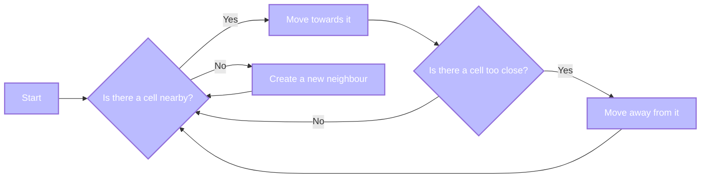

# Differential Growth Basics

I'm playing with the concept of differential growth, a technique used to simulate the growth of organic forms. The idea is to create a bunch of nodes, or "cells" which are bound by rules of attraction amongst themselves:

- Rule 1: A cell must always be within a certain distance of another cell, a basic social instinct
- Rule 2: A cell cannot be too close to another cell, for risks of overcrowding

To ensure cells are never too isolated, we can create new cells to fill the gaps. This is a simple implementation of the concept, but it can be used to create complex, beautiful, organic forms.

Here's the basic logic:



```js
import { draw, sketch } from "../components/sketch.js"
import { DifferentialGrowth } from "../lib/differential-growth.js"
```

## An example

In this sketch, we place cells in the form of a circle, and we let them grow following the rules of differential growth.

### Placing our cells

We want to start with our cells placed as a circle by leveraging using polar coordinates:

```js
draw(525, 295, (p5) => {
  createCircularPath(p5, p5.width / 2, p5.height / 2, 100).forEach((node) => {
    p5.ellipse(node.x, node.y, 5, 5)
  })
})
```

Here's the code to place our cells in a circle:

```js echo
function createCircularPath(p5, cx, cy, radius) {
  const path = []
  const cellCount = 40
  const angleStep = p5.TWO_PI / cellCount
  for (let angle = 0; angle <= p5.TWO_PI; angle += angleStep) {
    const x = cx + p5.cos(angle) * radius
    const y = cy + p5.sin(angle) * radius
    path.push(p5.createVector(x, y))
  }
  return path
}
```

### In action

When we run our differential growth simulation, we can see the cells moving based on our rules, which creates this organic behaviour

```js
sketch((p5) => {
  let dg = new DifferentialGrowth({ p5, minSeparation: 30 })
  const w = 525
  const h = 295

  p5.setup = () => {
    p5.createCanvas(w, h)
    dg.addPath(createCircularPath(p5, w / 2, h / 2, 100))
  }

  p5.draw = () => {
    p5.clear()
    p5.fill(255)
    dg.update()
    for (const path of dg.paths) {
      for (const node of path.nodes) {
        p5.ellipse(node.x, node.y, 5, 5)
      }
    }

    if (p5.frameCount >= 1000) p5.noLoop()
  }
})
```
