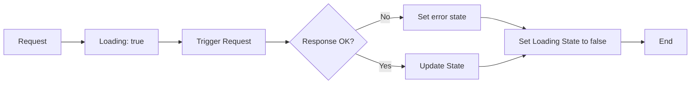

# Custom React API hook

<div class="note">
    This article was originally published in 2019 on <a href="https://dev.to/patrixr/react-writing-a-custom-api-hook-l16">dev.to</a>.
    I had a fair amount of traction at the time, given that packages such as `react-query` were not yet mainstream.
    Overall it was my own way of learning how hooks worked.
</div>

Let's write a handy custom react hook to take care of the usual API logic we've all written time and time again.

## Introduction

After a couple of years away from React, I'm re-educating myself on the best practices. This means : **[Hooks](reactjs.org/docs/hooks-reference.html)**

One of the very (**very**) common flow we find across our apps is that of loading data from the API and displaying it.

It usually looks somewhat like this :



This has a tendency to result in very **cluttered** components. Let's use our newfound knowledge of hooks to solve this.

## Designing the hook

Based on the flow described above, it's pretty easy to define the data that we want our hook to provide. It will return :

- The response data
- A loading flag
- An error (nulled on success)
- A retry method

Given that I still appreciate delegating the request code to a service class, my thought is to have the hook call the service.

Leading to the following usage:

```javascript
const [user, isLoading, error, retry] = useAPI("loadUserById", 56)
```

## Preparing the API service

Let's use a little service class, in which we can place all of our beautiful ajax code.

```javascript
class APIService {
  async loadUsers() {
    // ... ajax magic
  }

  async loadUserById(id) {
    // ... ajax magic
  }
}

export default new APIService()
```

## Writing the hook

Our goal here is simply to combine standard react hooks to create all of our required fields.

### The state

React already provides us with the [useState](https://reactjs.org/docs/hooks-reference.html#usestate) hook to create and update state properties.

Let's generate our fields :

```javascript
function useAPI(method, ...params) {
  const [data, setData] = useState(null)
  const [isLoading, setIsLoading] = useState(false)
  const [error, onError] = useState(null)
}
```

### Calling the service

The React hook that comes in play here is [useEffect](https://reactjs.org/docs/hooks-reference.html#useeffect), in which we can run our asynchronous code.

```javascript
useEffect(() => {
  // ... async code
}, [])
```

However, we've decided that the hook would return a `retry` method. So let's move the asynchronous code to its own function

```javascript
const fetchData = async () => {
  // ... async code
}

useEffect(() => {
  fetchData()
}, [])
```

Let's now call the correct service method, based on the hook's arguments

```javascript
const fetchData = async () => {
  // Clear previous errors
  onError(null)

  try {
    // Start loading indicator
    setIsLoading(true)

    // Fetch and set data
    setData(await APIService[method](...params))
  } catch (e) {
    // Set the error message in case of failure
    setError(e)
  } finally {
    // Clear loading indicator
    setIsLoading(false)
  }
}

useEffect(() => {
  fetchData()
}, [])
```

### Result

And voila ! Our hook is ready for consumption.

```javascript
function useAPI(method, ...params) {
  // ---- State
  const [data, setData] = useState(null)
  const [isLoading, setIsLoading] = useState(false)
  const [error, setError] = useState(null)

  // ---- API
  const fetchData = async () => {
    onError(null)
    try {
      setIsLoading(true)
      setData(await APIService[method](...params))
    } catch (e) {
      setError(e)
    } finally {
      setIsLoading(false)
    }
  }

  useEffect(() => {
    fetchData()
  }, [])

  return [data, isLoading, error, fetchData]
}
```

## Usage in a component

Let's write a little example of how that might be used in a component

```javascript
function HomeScreen() {
  const [users, isLoading, error, retry] = useAPI("loadUsers")

  // --- Display error
  if (error) {
    return <ErrorPopup msg={error.message} retryCb={retry}></ErrorPopup>
  }

  // --- Template
  return (
    <View>
      <LoadingSpinner loading={isLoading}></LoadingSpinner>
      {users && users.length > 0 && <UserList users={users}></UserList>}
    </View>
  )
}
```

## Conclusion

There are many ways to avoid re-writing common code across the application.

In the past I've often delegated some of that to a `Store`, or used `Mixins` to create components with all that logic ready to use.

**Custom hooks** give us a whole new flavour and open up new strategies for dealing with problems.

Happy to witness the evolution of practices.

Cheers,

Patrick
