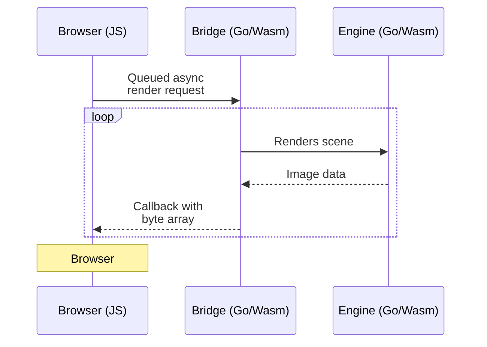

# Raytracing using Go and WebAssembly

```js
import {
  render,
  wasmScript,
  raytracerScript,
} from "../components/raytracing.js"
import { canvas } from "../components/canvas.js"
```

```js
import mermaid from "npm:@observablehq/mermaid"
```

This is an experiment in using Golang and WebAssembly to render a simple raytraced scene. The scene is rendered using a Go program that is compiled to WebAssembly and run in the browser.

The Go program is a simple raytracer based on the [Ray Tracing in One Weekend](https://raytracing.github.io/books/RayTracingInOneWeekend.html) book by Peter Shirley. The program defines a simple scene which is then piped to the browser using a `Uint8Array`. The browser then renders the scene using the `ImageData` API.


## The setup

This is a high-level overview of the different components involved:



## Limitations

I've discovered a main limitation with this approach: Goroutines are not supported in WebAssembly. This means that the Go program can't take advantage of parallelism to speed up the rendering process. Things still work fine but go routines will run sequentially instead of concurrently.

## Try it out

Click on the controls located below the canvas to render the scene. The "Low-res preview" button will render a low-resolution version of the scene just to try it out, while the "Full size" button will render the scene at full resolution.

<div class="warning" label="Warning️">
  Raytracing can be computationally expensive. Rendering the scene at full resolution with a high number of samples can take a while.
</div>

${raytracerScript()}
${wasmScript()}
${canvas(525, 295)}

## Configuration

```js
const renderButton = view(
  Inputs.button(
    [
      ["Low-res preview", () => render(config, "defaultCanvas0", true)],
      ["Full size", () => render(config, "defaultCanvas0")],
    ],
    { value: 0, label: "Render" },
  ),
)
```

### Config

```js
const samples = view(Inputs.range([1, 500], { step: 1, label: "Samples" }))
const size = view(Inputs.range([300, 750], { step: 1, label: "Width" }))
```

```js
const config = await FileAttachment("../data/static/rtconfig.json").json()
config.antialiasing.samples = samples
config.size = size
```

```js
display(config)
```
